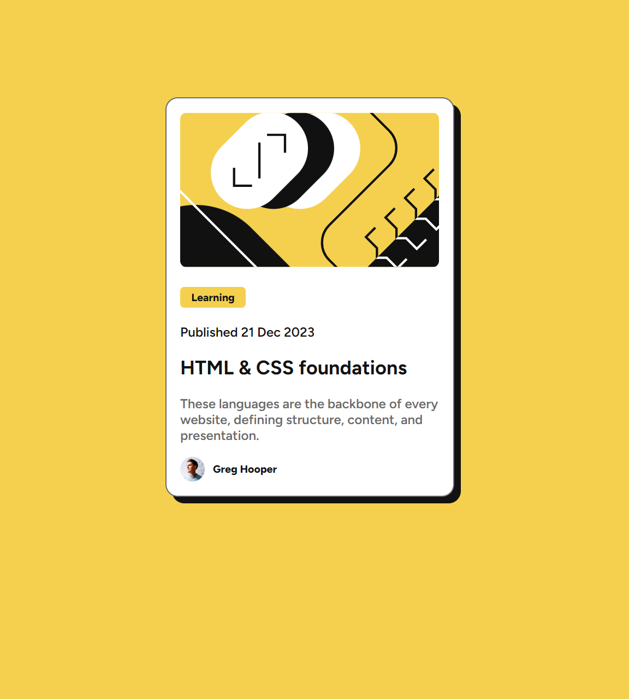

# Frontend Mentor - QR code component solution

This is a solution to the [Blog preview card challenge on Frontend Mentor](https://www.frontendmentor.io/challenges/blog-preview-card-ckPaj01IcS). Frontend Mentor challenges help you improve your coding skills by building realistic projects.

## Overview

### Screenshot

### Links

-   [Solution URL](https://www.frontendmentor.io/solutions/blog-preview-card-rMaQPVODGa)
-   [Live Site URL](https://WaRaGiSmYnIcKnAmE.github.io/blog-preview-card/)

## My process

### Built with

-   Semantic HTML5 markup
-   CSS custom properties
-   Flexbox

### What I learned

The solution was created as part of learning how to use the Frontend Mentor platform

## Author

-   Frontend Mentor - [@WaRaGiSmYnIcKnAmE](https://www.frontendmentor.io/profile/WaRaGiSmYnIcKnAmE)
